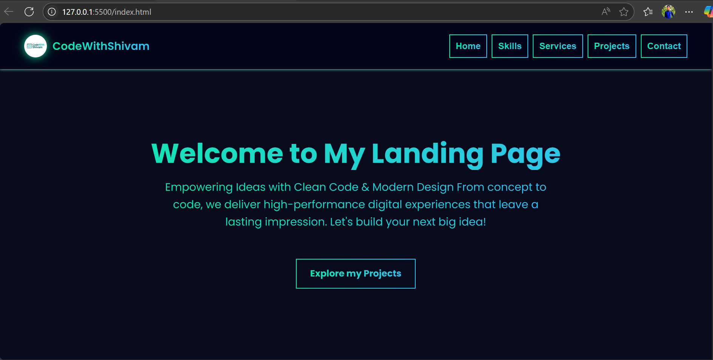
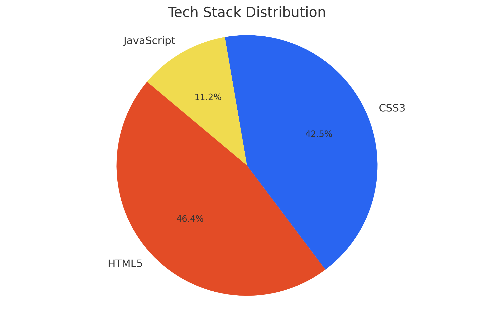

<!-- Landing Page -->
<h1 align="center">🚀 Landing Page</h1>

  A high-impact, fully responsive landing page built with modern web technologies — <b>HTML</b>, <b>CSS</b>, <b>JavaScript</b>, and <b>EmailJS API</b> integration. 
  Designed with a sleek, elegant interface and smooth user experience, it's perfect for showcasing <b>portfolios</b>, launching <b>startups</b>, promoting <b>products</b>, or presenting <b>services</b> with style and clarity.

  
  

---

<h1 align="center">📸 Online Preview</h1>

  

  

---

<h1 align="center">📖 Overview</h1>

A modern, fully responsive landing page thoughtfully crafted for developers, freelancers, and startups who want to establish a strong and professional digital presence.
Designed with clean code, seamless animations, and a mobile-first approach, it serves as the perfect solution for showcasing portfolios, launching new products, or promoting services with clarity, impact, and style.

<h1 align="center">⚡ Highlights</h1>

<table align="center">
  <tr>
    <td>✨</td>
    <td><strong>Clean and modern user interface</strong></td>
  </tr>
  <tr>
    <td>🎯</td>
    <td><strong>Responsive and mobile-first design</strong></td>
  </tr>
  <tr>
    <td>🔍</td>
    <td><strong>SEO-friendly semantic HTML</strong></td>
  </tr>
  <tr>
    <td>⚡</td>
    <td><strong>Fast loading with optimized assets</strong></td>
  </tr>
  <tr>
    <td>🌐</td>
    <td><strong>Deploy-ready with GitHub Pages</strong></td>
  </tr>
</table>

---

<h1 align="center">🎯 Key Features</h1>

<table align="center" width="90%">
  <tr style="background-color:#fdf6e3;">
    <td width="5%" align="center">✅</td>
    <td><strong>Responsive Design</strong> Looks great on all screen sizes</td>
  </tr>
  <tr style="background-color:#f0f8ff;">
    <td align="center">🎨</td>
    <td><strong>Animated Effects:- </strong> Smooth transitions for interactive sections.</td>
  </tr>
  <tr style="background-color:#fdf6e3;">
    <td align="center">🧹</td>
    <td><strong>Clean Codebase:- </strong> Simple, modular, and easy to understand.</td>
  </tr>
  <tr style="background-color:#f0f8ff;">
    <td align="center">🎛️</td>
    <td><strong>Fully Customizable:- </strong> Swap colors, content, sections quickly.</td>
  </tr>
  <tr style="background-color:#fdf6e3;">
    <td align="center">⚙️</td>
    <td><strong>No Framework Bloat:- </strong> Pure HTML/CSS/JS = blazing fast.</td>
  </tr>
  <tr style="background-color:#f0f8ff;">
    <td align="center">🌍</td>
    <td><strong>Cross-Browser Support:- </strong> Works perfectly across modern browsers.</td>
  </tr>
  <tr style="background-color:#fdf6e3;">
    <td align="center">♿</td>
    <td><strong>Accessible & Semantic:- </strong> Built for people and search engines.</td>
  </tr>
</table>

---

## 🛠 Tech Stack

<table>
  <tr>
    <th align="left">🌐 Technology</th>
    <th align="left">📊 Usage & Purpose</th>
  </tr>
  <tr>
    <td><strong>🔶 HTML5</strong></td>
    <td>Page structure & semantic layout (47.3%)</td>
  </tr>
  <tr>
    <td><strong>🔷 CSS3</strong></td>
    <td>Styling, animations, and responsiveness (43.3%)</td>
  </tr>
  <tr>
    <td><strong>🟡 JavaScript (ES6)</strong></td>
    <td>Interactive behavior & DOM manipulation (11.4%)</td>
  </tr>
  <tr>
    <td><strong>🚀 GitHub Pages</strong></td>
    <td>Fast, free deployment & hosting</td>
  </tr>
</table>

 

<table>
  <tr>
    <!-- Left: Chart -->
    <td align="center" width="50%">
      
    </td>
    <!-- Right: Badges -->
    <td align="center" valign="middle">
        
        
      
    </td>
  </tr>
</table>

---

   © 2025, ShivamMaurya2002. 🚀 Built with passion and precision by <strong><a href="https://github.com/ShivamMaurya2002" target="_blank">Shivam Maurya</a></strong>

